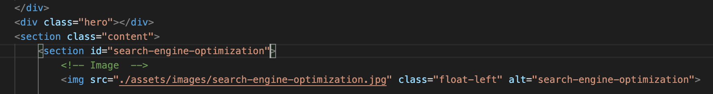

 ## Search Engine Optimization

# Description

The project was geared towards a building a website that was accessible the vast majority of the people that would also include people with disablilities. The main goal was to convert a complex more difficult to use website into a simple more easy to use site as accessbility is an important consideration for business.

# Steps taken to build an accessible website

There were a couple of bugs found in the website that included navbar links not loading properly, headings labelled incorrectly, semantics not used properly and some css errors which could have been made simple.
* There first thing that i started off with was when one would view the source code the semantic HTML elements would lay perfectly in order and where they all belong.
* Secondly, the structure of the HTML elements now follow a logical order.
* The images did not include alt attributes which was fixed by adding appropriate alt atributes at their right place.
* The heading attributes were all misplaced in wrong order so they fixed in the right order as well which would also match with the css file.
* The web page did not include a title which was replaced with a concise title "Search Engine Optimization" this tells the audience what our website could do to help them.
* One of the links on the web page did not work due to bug that did not include the "id." A screenshot is linked here:

This bug was fixed by adding the correct id to it which was also then linked to the css file.

* The CSS file contained some id and classes that all had the same code and were taking more space so some of them were deleted by simply just adding a common name and then also replacing them with that "common" name in the HTML file to reflect those changes to our website. This was done to make our CSS file even more clean.
* The CSS file now also contains comments that helps the developer understand the css file and its relation to the html file much better

## Conclusion

Refactoring the original code to improve it while not changing much on the website was a little challenging at first but was able to fix small changes on the existing web page to make it more accessible. Now the web page is running smoothly without any bugs and code looks cleaner and are easy to read.

The URL of the deployed application: https://hassany99.github.io/hw1-code-refactor/